# **Ensemble / Interoperability Formation**

- [**Ensemble / Interoperability Formation**](#ensemble--interoperability-formation)
  - [1. Prerequisites](#1-prerequisites)
  - [2. Goal](#2-goal)
  - [3. The framework](#3-the-framework)
  - [4. Docker and saving progress](#4-docker-and-saving-progress)
  - [5. Productions](#5-productions)
  - [6. Operations](#6-operations)
    - [6.1. Creating our storage class](#61-creating-our-storage-class)
    - [6.2. Creating our message class](#62-creating-our-message-class)
    - [6.3. Creating our operation](#63-creating-our-operation)
    - [6.4. Adding the operation to the production](#64-adding-the-operation-to-the-production)
    - [6.5. Testing](#65-testing)
  - [7. Business Processes](#7-business-processes)
    - [7.1. Simple BP](#71-simple-bp)
    - [7.2. BP reading CSV lines](#72-bp-reading-csv-lines)
      - [7.2.1. Creating a record map](#721-creating-a-record-map)
      - [7.2.2. Creating a Data Transformation](#722-creating-a-data-transformation)
      - [7.2.3. Adding the Data Transformation to the Business Process](#723-adding-the-data-transformation-to-the-business-process)
      - [7.2.4. Configuring Production](#724-configuring-production)
      - [7.2.5. Testing](#725-testing)
  - [8. Getting access to an extern database using JDBC](#8-getting-access-to-an-extern-database-using-jdbc)
    - [8.1. Creating our new operation](#81-creating-our-new-operation)
    - [8.2. Configuring the production](#82-configuring-the-production)
    - [8.3. Testing](#83-testing)

## 1. Prerequisites

 For this formation, you'll need:
* VSCode: https://code.visualstudio.com/
* The InterSystems addons suite for vscode: https://intersystems-community.github.io/vscode-objectscript/installation/
* Docker: https://docs.docker.com/get-docker/

## 2. Goal 

The goal of this formation is to learn InterSystems' interoperability framework, and particularly the use of: 
* Productions
* Messages
* Business Operations
* Adapters
* Business Processes
* Business Services
* REST Services and Operations
## 3. The framework

This is the framework we will be working with:
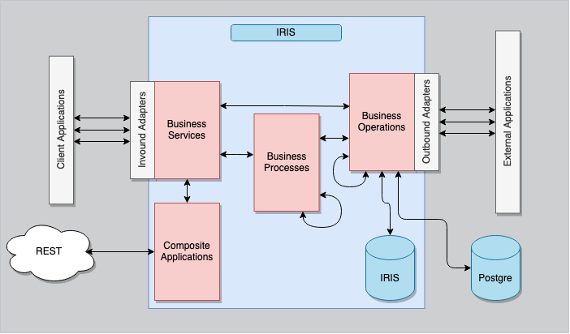

All of these components form a production. The arrows between them are **messages**. 
In the first place, we will build a production, with its operations, services and processes that will enable us to read data from a CSV file and save it in the iris database.


Then, we will see how to save all of our data in an extern database, namely a postgre database, in another docker container.


Finally, we will see how to use composite applications to insert new objects in our database or to consult this database (through a REST service).


After building and composing our containers with the `docker-compose.yml` and `Dockerfile` files given, we will open a Management Portal. It will give us access to an HMI where we will be able to create our productions. The portal should be located at the url: http://localhost:52775/csp/sys/UtilHome.csp?$NAMESPACE=IRISAPP. 

## 4. Docker and saving progress

A part of the things we will be doing will be saved locally, but all the processes and productions are saved in the docker container. In order to persist all of our progress, we need to export every class that is created through the Management Portal with the intersystems addon `ObjectScript`:

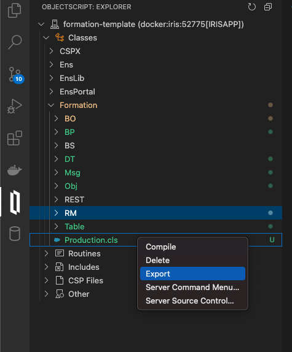

We will have to save our Production, Record Map, Business Processes and Data Transfromation this way. After that, when we close our docker container and compose it up again, we will still have all of our progress saved locally (it is, of course, to be done after every change through the portal). To make it accessible to IRIS again we need to compile the exported files (by saving them).
## 5. Productions 
We can now create our first production. For this, we will go through the Interoperability and Configure menus: 


We then have to press `New`, select the `Formation` package and chose a name for our production: 

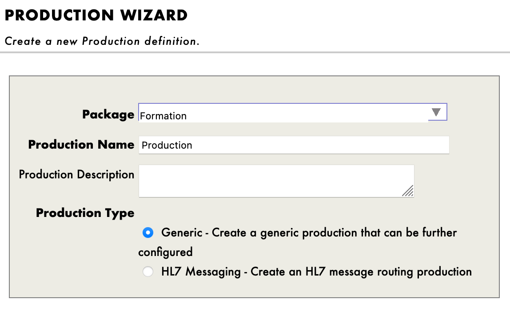

Immediatly after creating our production, we will need to click on the `Production Settings` just above the `Operations` section. In the right sidebar menu, we will have to activate `Testing Enabled` in the `Development and Debugging` part of the `Settings` tab (don't forget to press Apply).

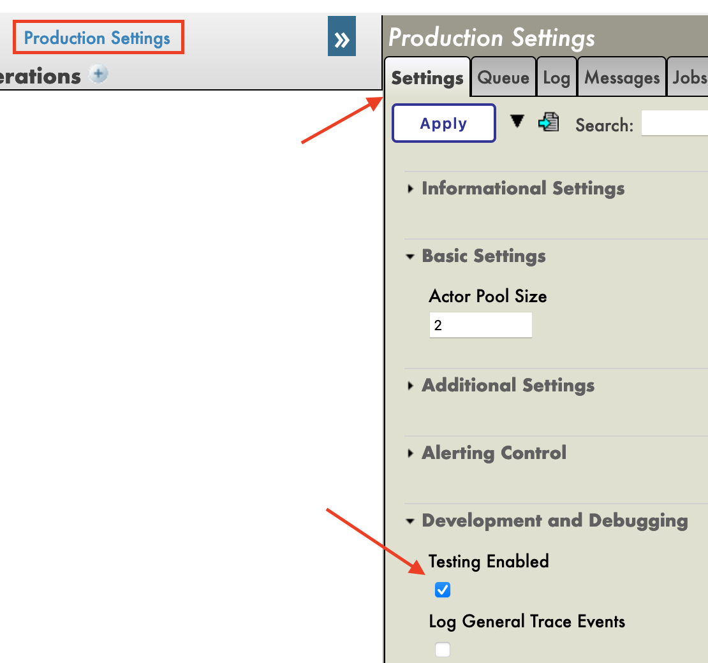

In this first production we will now add Business Operations.

## 6. Operations

A Business Operation (BO) is a specific operation that will enable us to send requests from IRIS to an external application / system. It can also be used to directly save in IRIS what we want.

We will create those operations in local, that is, in the `Formation/BO` file. Saving the files will compile them in IRIS. 

For our first operation we will save the content of a message in  the local database.

We need to have a way of storing this message first. 

### 6.1. Creating our storage class

Storage classes in IRIS extends the type `%Persistent`. They will be saved in the intern database.

In our `Formation/Table/Formation.cls` file we have: 
```objectscript
Class Formation.Table.Formation Extends %Persistent
{

Property Name As %String;

Property Salle As %String;

}
```

Note that when saving, additional lines are automatically added to the file. They are mandatory and are added by the InterSystems addons.

### 6.2. Creating our message class

This message will contain a `Formation` object, located in the `Formation/Obj/Formation.cls` file: 
```objectscript
Class Formation.Obj.Formation Extends (%SerialObject, %XML.Adaptor)
{

Property Nom As %String;

Property Salle As %String;

}
```

The `Message` class will use that `Formation`object; `src/Formation/Msg/FormationInsertRequest`:
```objectscript
Class Formation.Msg.FormationInsertRequest Extends Ens.Request
{

Property Formation As Formation.Obj.Formation;

}
```

### 6.3. Creating our operation

Now that we have all the elements we need, we can create our operation, in the `Formation/BO/LocalBDD` file: 
```objectscript
Class Formation.BO.LocalBDD Extends Ens.BusinessOperation
{

Parameter INVOCATION = "Queue";

Method InsertLocalBDD(pRequest As Formation.Msg.FormationInsertRequest, Output pResponse As Ens.StringResponse) As %Status
{
    set tStatus = $$$OK
    
    try{
        set pResponse = ##class(Ens.Response).%New()
        set tFormation = ##class(Formation.Table.Formation).%New()
        set tFormation.Name = pRequest.Formation.Nom
        set tFormation.Salle = pRequest.Formation.Salle
        $$$ThrowOnError(tFormation.%Save())
    }
    catch exp
    {
        Set tStatus = exp.AsStatus()
    }

    Quit tStatus
}

XData MessageMap
{
<MapItems>
    <MapItem MessageType="Formation.Msg.FormationInsertRequest"> 
        <Method>InsertLocalBDD</Method>
    </MapItem>
</MapItems>
}

}

```

The MessageMap gives us the method to launch depending on the type of the request (the message sent to the operation).

As we can see, if the operation received a message of the type `Formation.Msg.FormationInsertRequest`, the `InsertLocalBDD` method will be called. This method will save the message in the IRIS local database.

### 6.4. Adding the operation to the production

We now need to add this operation to the production. For this, we use the Management Portal. By pressing the `+` sign next to `Operations`, we have access to the Business Operation Wizard. There, we chose the operation class we just created in the scrolling menu. 

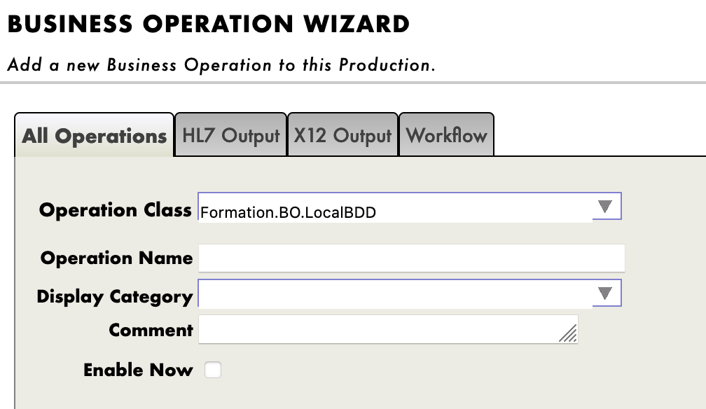

### 6.5. Testing

Double clicking on the operation will enable us to activate it. After that, by selecting the operation and going in the `Actions` tabs in the right sidebar menu, we should be able to test the operation (if not see the production creation part to activate testings / you may need to start the production if stopped).

By doing so, we will send the operation a message of the type we declared earlier. If all goes well, the results should be as shown below: 

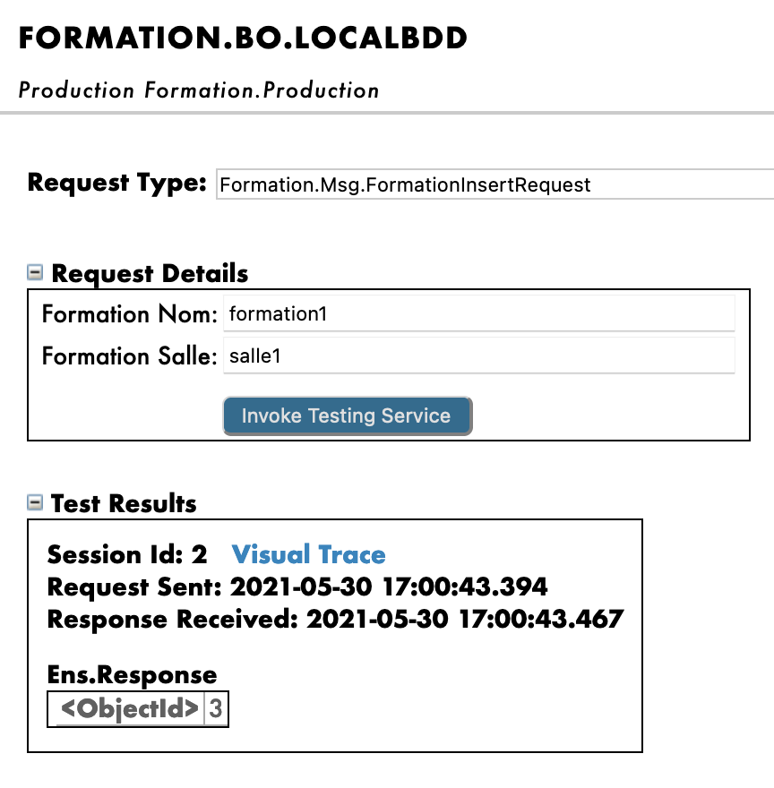

Showing the visual trace will enable us to see what happened between the processes, services and operations. here, we can see the message being sent to the operation by the process, and the operation sending back a response (that is just an empty string).

## 7. Business Processes

Business Processes (BP) are the business logic of our production. They are used to process requests or relay those requests to other components of the production.

Business Processes are created within the Management Portal:

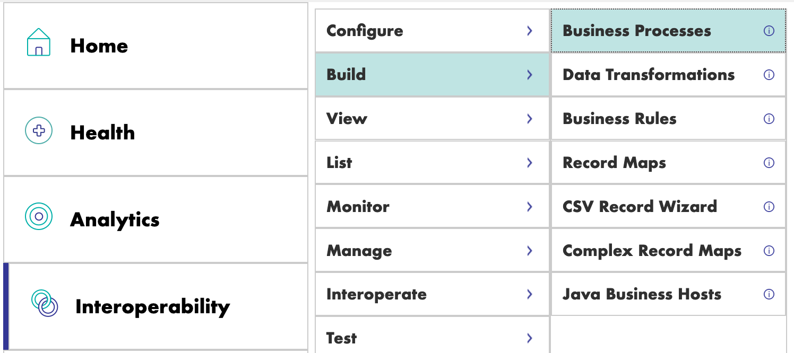

### 7.1. Simple BP

We are now in the Business Process Designer. We are going to create a simple BP that will call our operation: 


A BP has a **Context**. It is composed of a request class, the class of the input, and of a response class, the class of the output. **BP only have one input and one output**. It is also possible to add properties. 

Since our BP will only be used to call our BO, we can put as request class the message class we created (we don't need an output as we just want to insert into the database).

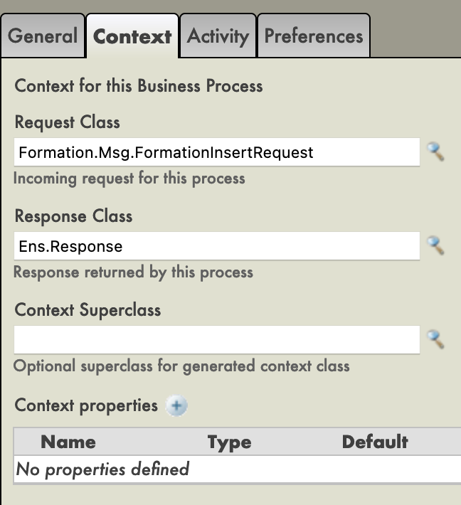

We then chose the target of the call function : our BO. That operation, being **called** has a **callrequest** property. We need to bind that callrequest to the request of the BP (they both are of the class ‘Formation.Msg.FormationInsertRequest‘), we do that by clicking on the call function and using the request builder: 


We can now save this BP (in the package ‘Formation.BP‘ and under the name ‘InsertLocalBDD‘ for example). Just like the operations, the processes can be instantiated and tested through the production configuration, for that they need to be compiled beforehand (on the Business Process Designer screen).

Our Process for now only passes the message to our Operation. We are going to complexify it so that the BP will take as input one line of a CSV file. 


### 7.2. BP reading CSV lines

#### 7.2.1. Creating a record map

In order to read a file and put its content into a file, we need a Record Map (RM). There is a Record Mapper sepcialized for CSV files in the `Interoperability > Build` menu of the management portal: 

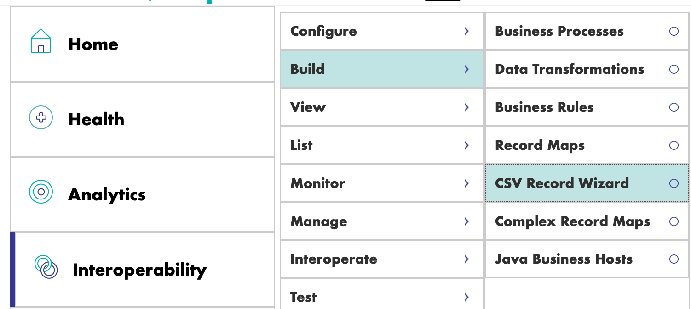

We will create the mapper like this: 

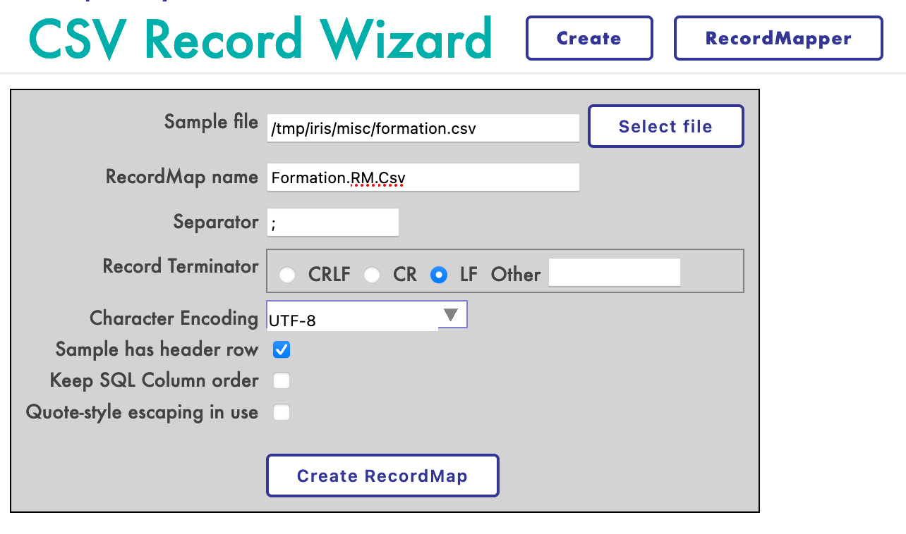

You should now have this Record Map: 

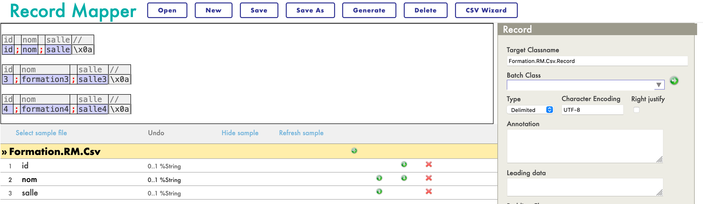

Now that the Map is created, we have to generate it (with the Generate button). We now need to have a Data Transformation from the record map format and an insertion message.

#### 7.2.2. Creating a Data Transformation

We will find the Data Transformation (DT) Builder in the `Interoperability > Builder` menu. We will create our DT like this (if you can't find `Formation.RM.Csv.Record`, maybe you didn't generate the record map): 

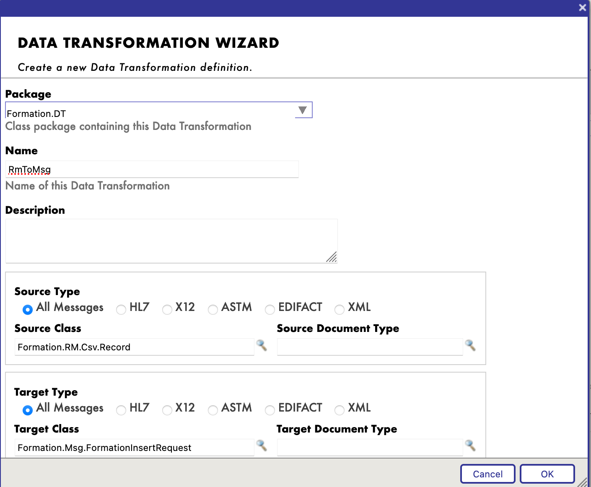

Now, we can map the different fields together:


Don't forget to compile.

#### 7.2.3. Adding the Data Transformation to the Business Process

The first thing we have to change is the BP's request class, since we need to have in input the Record Map we created.

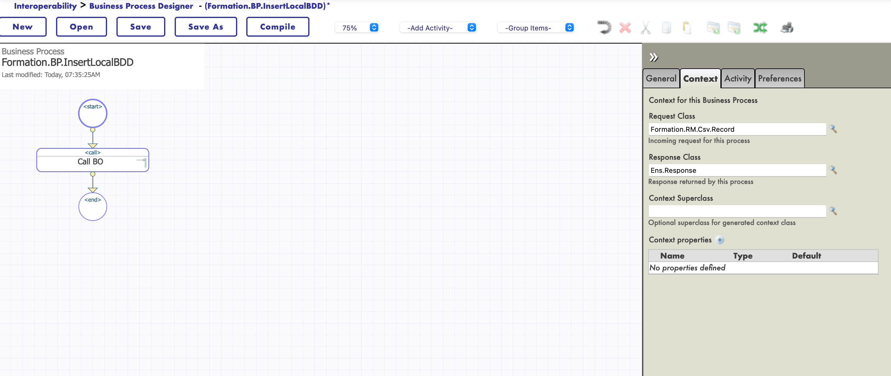

We can then add our transformation (the name of the process doesn't change anything, from here we chose to name it `Main`): 


The transform will take the request of the BP (a Record of the CSV file, thanks top our Record Mapper), and transform it into a `FormationInsertRequest` message. In order to store that message to send it to the BO, we need to add a property to the context of the BP. 

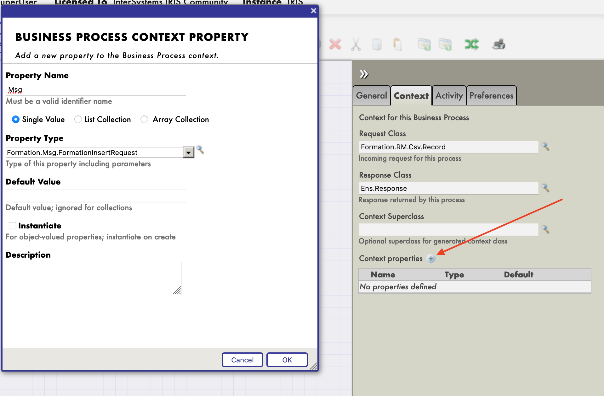

We can now configure our transform function so that it takes it input as the input of the BP and saves its output in the newly created property. The source and target of the `RmToMsg` transformation are respectively `request` and `context.Msg`:

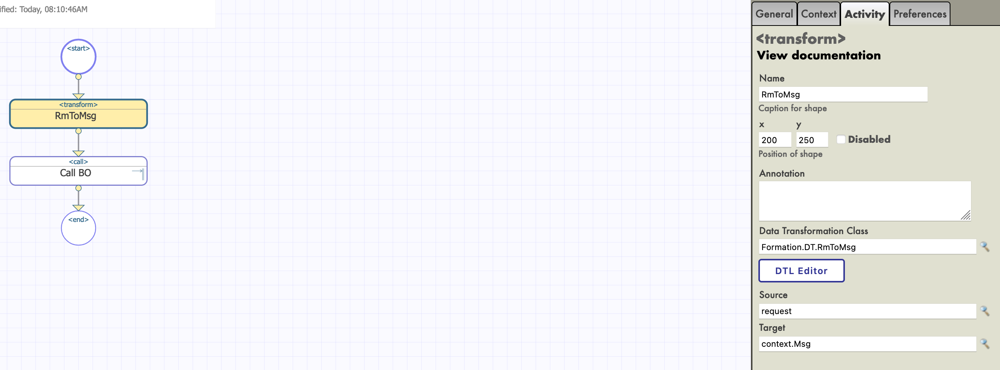

We need to do the same for `Call BO`. Its input, or `callrequest`, is the value stored in `context.msg`: 


In the end, our new BP can be represented like this: 

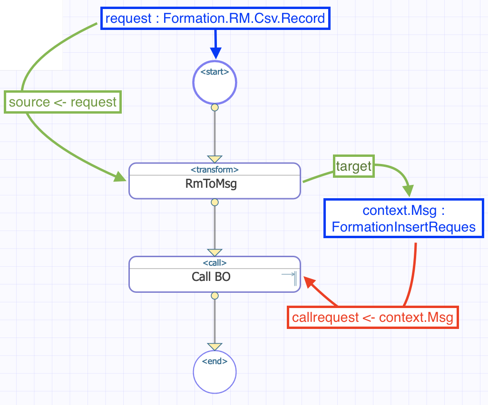

#### 7.2.4. Configuring Production

With the `+` sign, we can add our new process to the production (if not already done). We also need a generic service to use the record map, we use `EnsLib.RecordMap.Service.FileService` (we add it with the `+` button next to services). We then parameter this service: 


We should now be able to test our BP.

#### 7.2.5. Testing 

We can now test the whole production: 


In `System Explorer > SQL` menu, you can execute the command
````sql
SELECT 
ID, Name, Salle
FROM Formation_Table.Formation
````
to see the objects we just saved.


## 8. Getting access to an extern database using JDBC

In this section, we will create an operation to save our objects in an extern database. We will be using the JDBC API, as well as the other docker container that we set up, with postgre on it. 

### 8.1. Creating our new operation

Our new operation, in the file `Formation/BO/RemoteBDD` is as follows: 

````objectscript
Include EnsSQLTypes

Class Formation.BO.RemoteBDD Extends Ens.BusinessOperation
{

Parameter ADAPTER = "EnsLib.SQL.OutboundAdapter";

Property Adapter As EnsLib.SQL.OutboundAdapter;

Parameter INVOCATION = "Queue";

Method InsertRemoteBDD(pRequest As Formation.Msg.FormationInsertRequest, Output pResponse As Ens.StringResponse) As %Status
{
	set tStatus = $$$OK
	
	try{
		set pResponse = ##class(Ens.Response).%New()
		set ^inc = $I(^inc)
		set tInsertSql = "INSERT INTO public.formation (id, nom, salle) VALUES(?, ?, ?)"
		$$$ThrowOnError(..Adapter.ExecuteUpdate(.nrows,tInsertSql,^inc,pRequest.Formation.Nom, pRequest.Formation.Salle ))
	}
	catch exp
	{
		Set tStatus = exp.AsStatus()
	}

	Quit tStatus
}

XData MessageMap
{
<MapItems>
	<MapItem MessageType="Formation.Msg.FormationInsertRequest"> 
		<Method>InsertRemoteBDD</Method>
	</MapItem>
</MapItems>
}

}
````

This operation is similar to the first one we created. When it will receive a message of the type `Formation.Msg.FormationInsertRequest`, it will use an adapter to save it into the an sql database.

### 8.2. Configuring the production

Now, through the Management Portal, we will instanciate that operation (by adding it with the `+` sign in the production).

We will also need to add the JavaGateway for the JDBC driver in the services. The full name of this service is `EnsLib.JavaGateway.Service`.


We now need to configure our operation. Since we have set up a postgre container, and connected its port `5432`, the value we need in the following parameters are:

>DSN: `jdbc:postgresql://db:5432/DemoData`
>
>JDBC Driver: `org.postgresql.Driver`
>
>JDBC Classpath: `/tmp/iris/postgresql-42.2.14.jar`

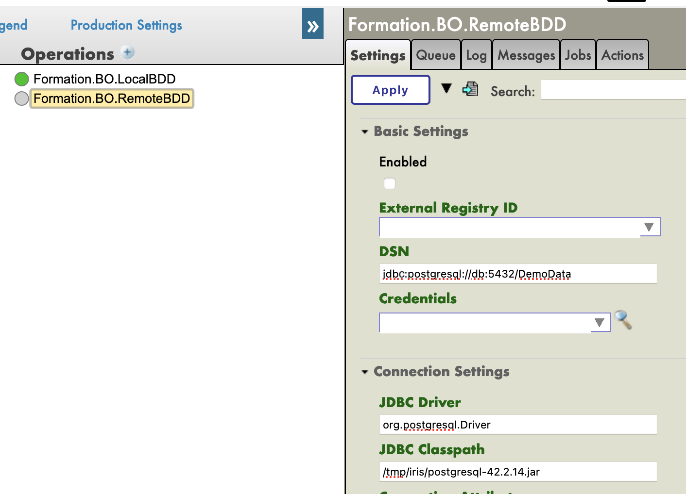

Finally, we need to configure the credentials to have access to the remote database. For that, we need to open the Credential Viewer: 

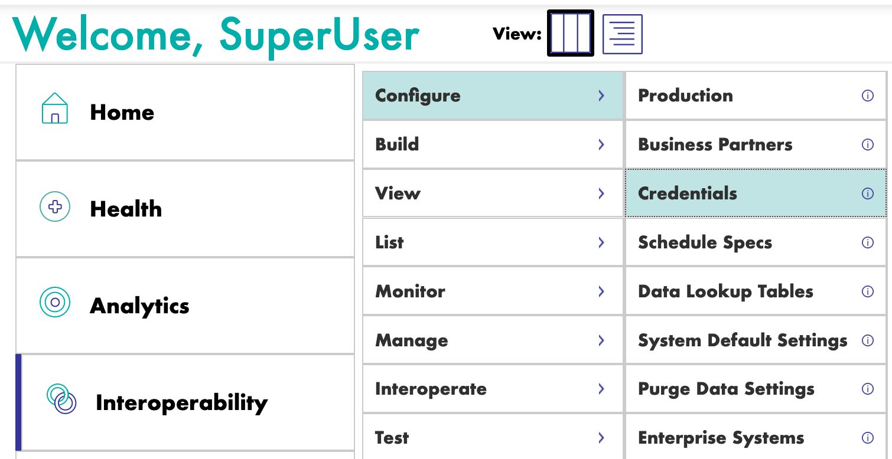

The login and password are both `DemoData`, as we set up in the `docker-compose.yml` file.


Back to the production, we can add `"Postgre"` in the `Credential` field in the settings of our operation (it should be in the scrolling menu). Before being able to test it, we need to add the JGService to the operation. In the Settings tab, in the Additional Settings: 

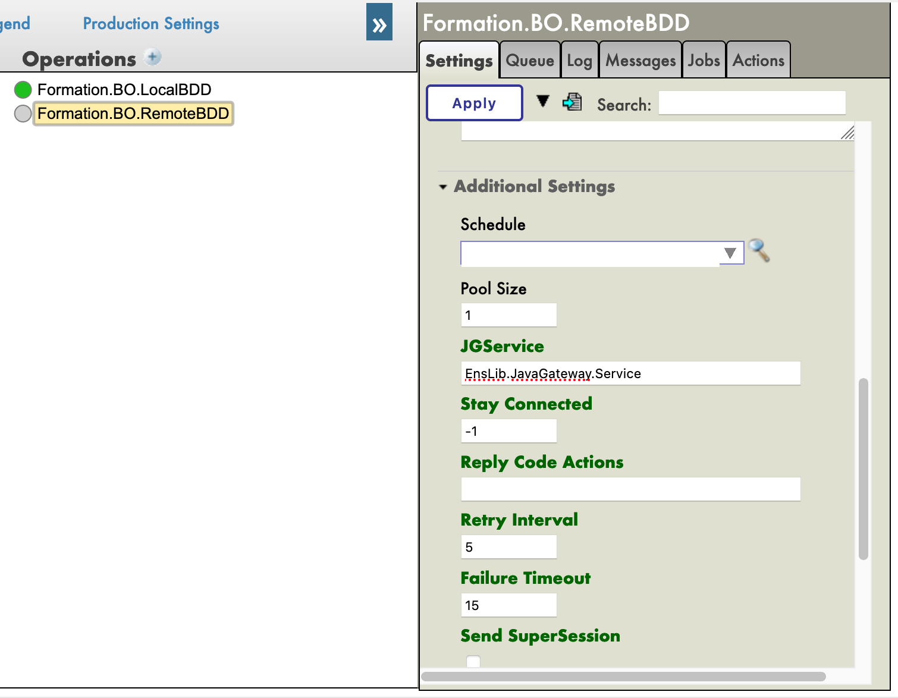

### 8.3. Testing

When testing the visual trace should show a success: 


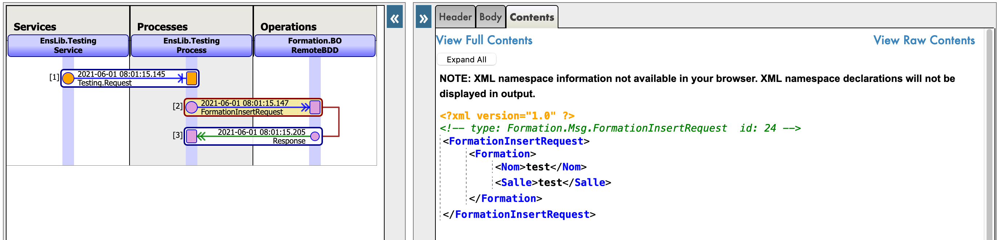

We have successfully connected with an extern database. 

As an exercise, it could be interesting to modify our BP and our BO.LocalBDD so that the operation returns a boolean that will tell the BP to call BO.RemoteBDD depending on the value of that boolean. This can be done by changing the type of reponse LocalBDD returns and by adding a new property to the context and using the `if` activity in our BP.